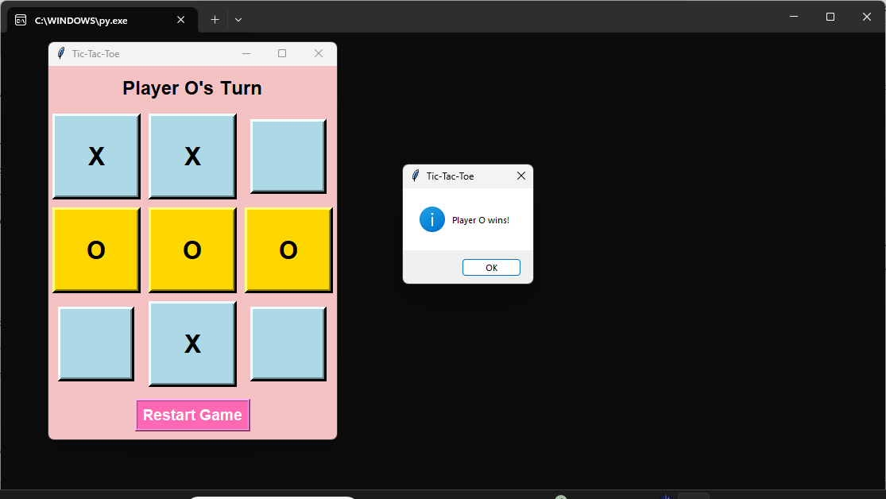

<h1 align="center">❌⭕Tic Tac Toe Game (Tkinter)</h1>

<p align="center">
  A simple yet fun <b>Tic-Tac-Toe</b> game built using <b>Python</b> and <b>Tkinter</b>.  
  Play with a friend, enjoy the colorful UI, and see the winner highlighted instantly!🎮✨  
</p>

---

<p align="center">
  
  
  
</p>

---

## 🌟Project Preview

<p align="center">
  
</p>

---

## 🎮About The Game

**Tic Tac Toe** is a classic 2-player strategy game where players take turns marking:

- ❌Player X  
- ⭕Player O  

The first player to align **3 marks in a row** wins the game!

---

## ✨Features

✤**User-Friendly Interface**  
Soft pastel tones with a clean and colorful layout.

✤**Two-Player Mode**  
Play alternately as **X** and **O** with your friend.

✤**Winner Highlighting**  
Winning tiles glow golden when a player wins.

✤**Tie Detection**  
Shows an alert when the game ends in a draw.

✤**Restart Button**  
Reset anytime and start a fresh match instantly.

---

## 🛠️Technologies Used

<p align="center">
  
</p>

- **Python**  
- **Tkinter** (GUI Library)

---

## ⚙️Installation & Setup

Follow these steps to run the game locally:

### Clone the repository
```
git clone https://github.com/your-username/tic-tac-toe-tkinter.git
```

### Navigate into the folder
```
cd tic-tac-toe-tkinter
```

### Run the game
```
python main.py
```

---
## 🎯How to Play

✤Run the script <br>
✤Player X starts first by clicking any grid cell <br>
✤Player O plays next <br>
✤The game automatically checks for : <br>
- Winner🏆 <br>
-  Draw🤝 <br>
✤ Click Restart Game anytime to play again! <br>

---
## 🚀Future Improvements

Want to enhance this project? Here are some cool ideas: <br>

✤🤖Add an AI Player (Single Player Mode) <br>
✤📊Add Score Tracking for multiple rounds <br>
✤🎨Improve UI with custom themes & animations <br>

---
## 👩‍💻Author

**Nandini Saxena** <br>
🎓B.Tech (Computer Science & Engineering) <br>
💡Passionate about Python, GUI Development, and building fun interactive projects

<p align=center>
✨If you like this project, don’t forget to ⭐ the repository, it really supports my work💙
</p>
